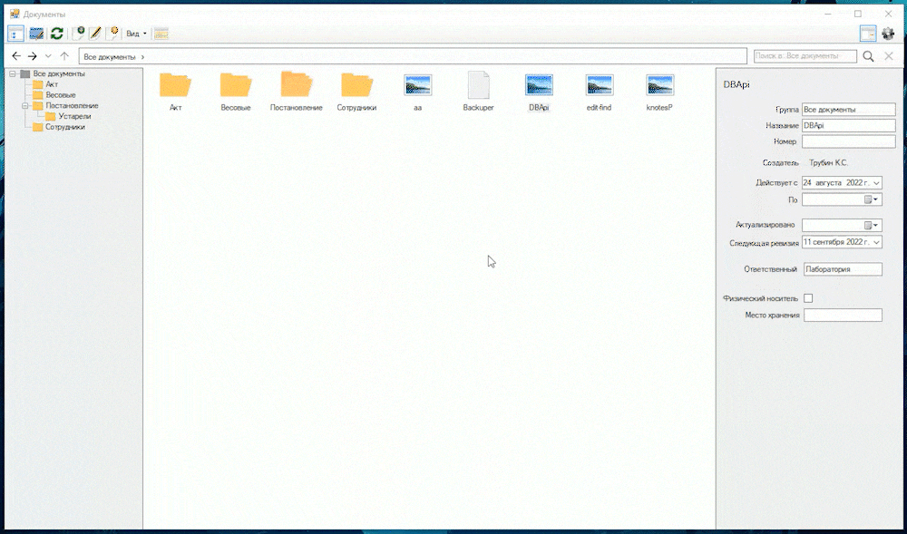
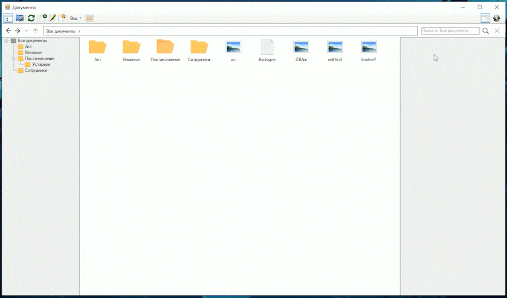
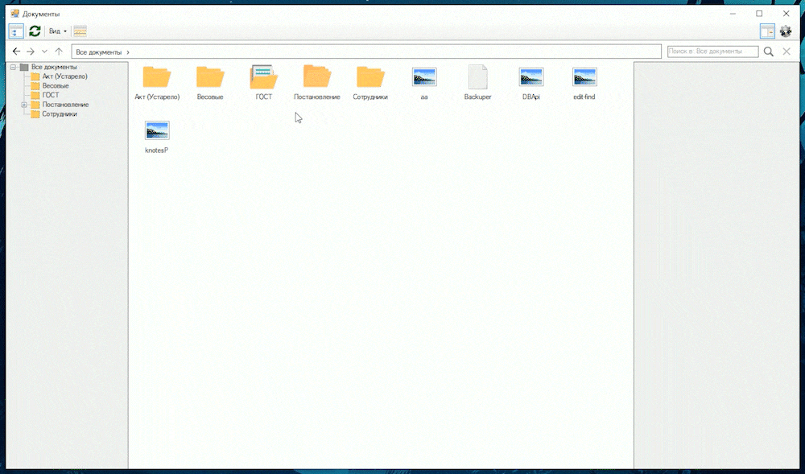
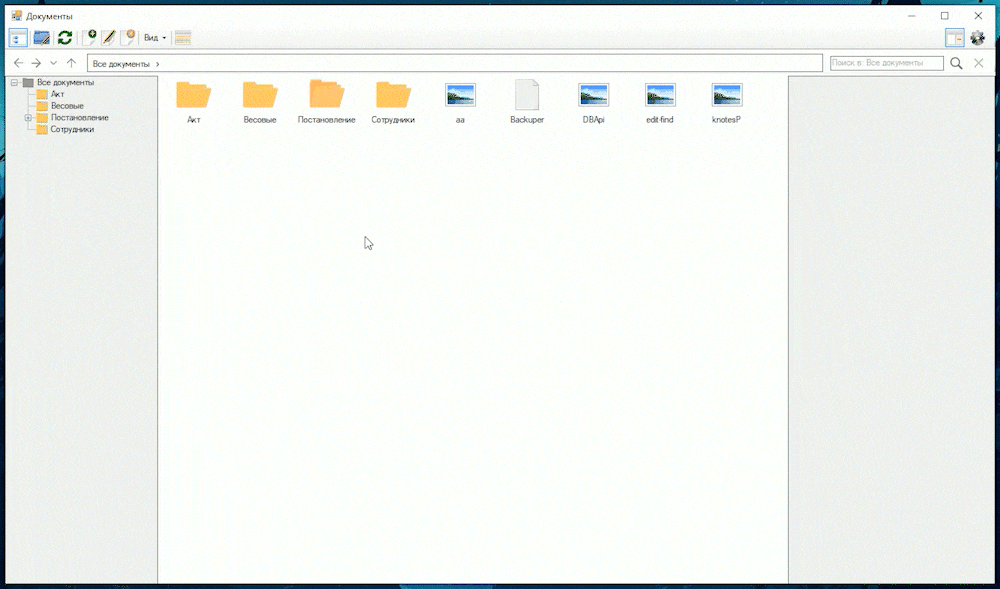
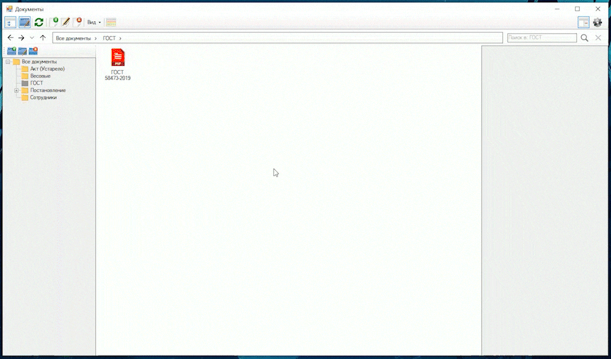
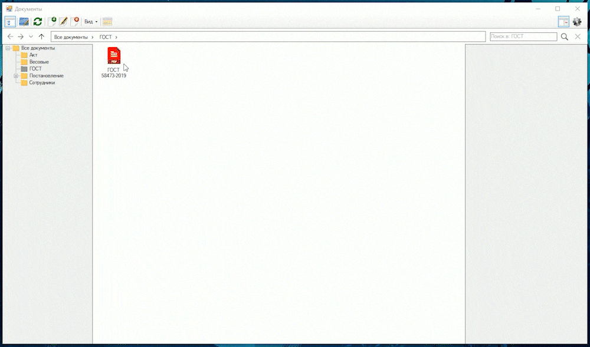

### Электронный документооборот
---

Задача: собрать все документы предприятия и сведения о них в одном месте 

___

#### Интерфейс

Было решено сделать интерфейс максимально похожим на Проводник Windows. 
Это позволит быстро и просто разобраться даже самому далёкому от компьютеров сотруднику.
Также, есть увереность, что такой подход создасть единый стиль по добавлению документов.

Добавлен функционал на ПКМ,  ctrl+c для копирования документов прямо из сетевого диска,
клавиша delete и много других мелких доработок.



Для удобства в программу добавили окно настроек. 
Можно изменить размеры иконок, выбрать шрифт и проверить/настроить соединение с сетевым диском.



___

#### Авторизация

Неотъемлемая часть данной программы - контроль прав пользователей. 
По стандарту запускается в режиме чтения, но если есть необходимость в добавлении или редактировании, 
то пользователю нужно пройти авторизацию. Это позволит вести контроль за действиями. 



___

#### Группы и документы

По сути, можно выделить три модели: группа, документ и файл.

Группа - что-то вроде папки в проводнике, она хранит файлы. 
В конечном итоге из групп выстроится отсортированная структура.

С группами мы можем взаимодействовать как в дереве слева, так и в основном окне, совместно с документами:



Документы хранят в себе много полезной информации: дату создания, окончания, ревизию,
номер, создателя, владельца (это не одно и то же) и другие необходимые поля.

Вот так выглядит создание и редактирование документа:


Стоит отметить, что документ != файл.
Например, для одного ГОСТа может быть несколько версий в зависимости от года.



___

#### Где всё это хранится

Так как приложение требуется только в рамках предприятия, никакого API не требуется. 
Все *физические* файлы хранятся в специальном секторе на диске сервера и
работают по принцупу обычного сетевого диска windows. 

___

#### Режим ревизии

Некоторые важные документы требуют ревизию как минимум раз в два года на законодательном уровне.
Поэтому есть режим *ревизии*. В нём документы, требующие скорой сверки, подсвечиваются жёлтым и
красным - те, срок которых подошёл к концу.



```
Использовал:
  .Net 4.0
  WindowsForms
  Odbc
```

:pushpin: Есть сохранение состояния окна (абсолютно всё, даже состояние раскрытых узлов) в реестр.

***На предприятии остались устройства под Windows XP, поэтому использую .Net 4.0***
