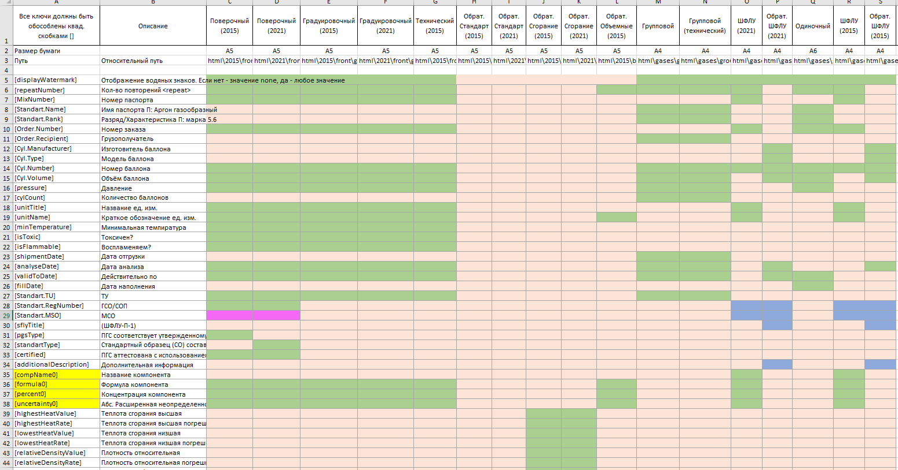
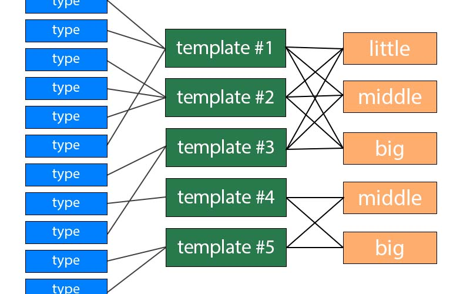
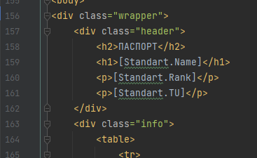
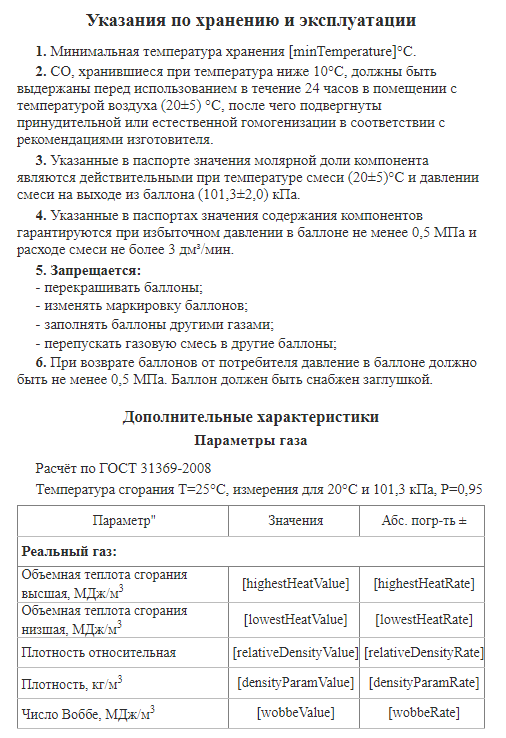
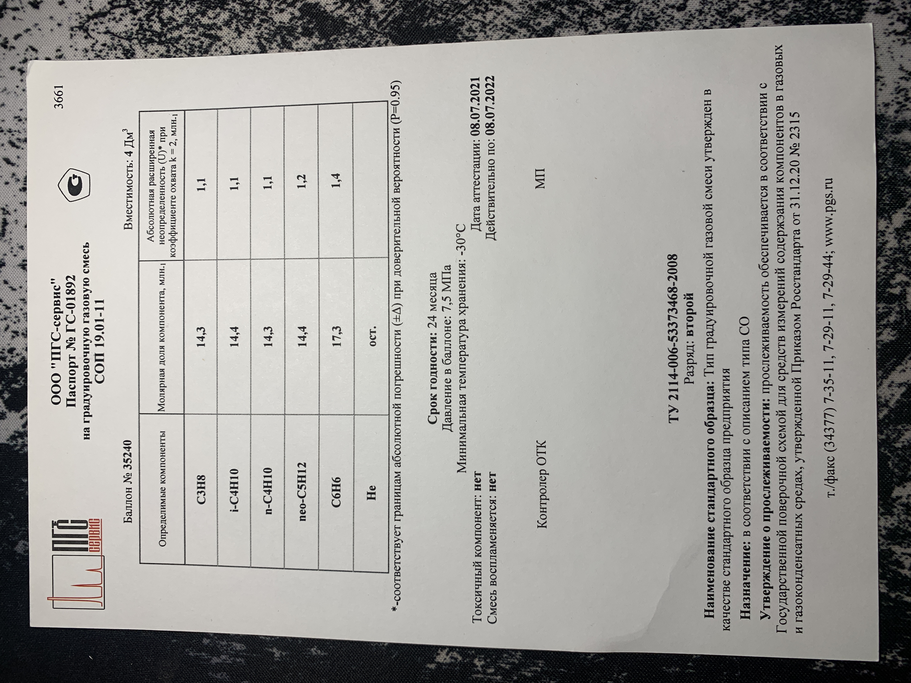

### Паспорта
---

Задача: Реализовать печать паспортов для готовых изделий от макета до печати на принтере

На каждое готовое изделие должен выдаваться сертификат. 
Необходимо придумать дизайн (в некоторых случаях обновить), 
наполнить его данными из бд и передать на печать принтеру.
___

#### Типы паспортов
Для каждого вида изделия необходим свой паспорт (их достаточно много, около 20). Но некоторые имеют сходства (зелёные ячейки), 
поэтому было решено выделить общие шаблоны, которые изменятся на этапе наполнения информацией.




___

#### Шаблоны
Помимо разнообразия типов, каждое изделие может содержать в себе от 2 до 17+ компонентов, 
и всё эту нужно уместить на листе A5. Если составить шаблон с запасом, т.е. с расчётом на большое кол-во примесей, 
то появится пустое пространство в половину листа для малого числа компонентов. 
Было принято решение использовать стили для шаблонов, исходя из количества веществ: little, middle, big.

```Итого: 20x3 шаблонов?```

Нет! После сопоставления данных, необходимых для паспорта изделия, удалось выделить общие ***шаблоны***.



Для создания такой логики было принято использовать HTML/CSS.

В шаблонах были выделены места для подстановки в виде названия переменных. Пример:


___

#### Сборка

Осталось подставить данные и выбрать нужный стиль, всё это происходит на этапе сборки.

Сначала подбираем стиль (от числа компонентов). Из-за "особенности" печати нужно объединить HTML и CSS в один файл, 
благо была найдена версия *инлайнера* работающая с .Net 4.0. 
Со стилями:



Вот теперь можно наполнить шаблон данными и отправить на печать.
___

#### Печать

Самый проблемный этап - это печать. Нету адекватного инструмента (тут надо понимать, что нужна поддержка Windows XP).
Даже рефлексия (Windows API) тут не помогает, 
поэтому всю конфигурацию будем производить через изменение стандартных настроек печати в реестре. 

Для печати HTML необходим веб-драйвер, который соберёт страничку и отправит на печать.
Тут использую встроенный инструмент форм WebBrowser. 

Итог:



___

```
Использовал:
  .Net 4.0
  HTML, CSS
  WindowsForms
  Odbc
  PreMailer
  CsQuery
```

***На предприятии остались устройства под Windows XP, поэтому использую .Net 4.0***
