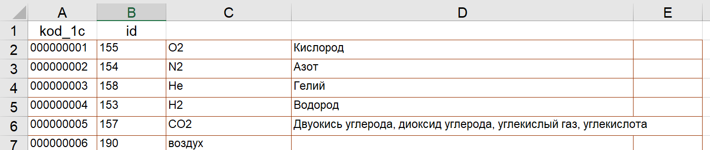

### Заполнение компонентов 1С
---

Задача: сопоставить ID компонентов 1С с записями из новой бд PostgreSQL

Для удобства данные из 1С конвертируются в Excel лист.


```
Использовал:
  Microsoft.Office.Interop.Excel
  Odbc
```
