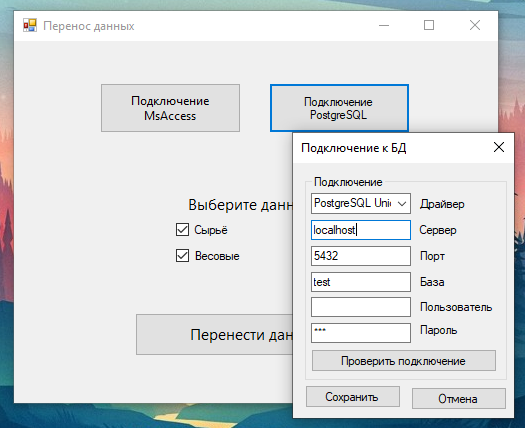

### dbMigration
---

Задача: перенести данные из MS Access в PostgreSQL с изменение структуры таблиц (Одну таблицу разделить на 5)

Так как MS Access и дальше будет использоватся,
запускать скрипт будут не один раз,
поэтому необходимо добавить UI для выбора mdb-файла,
настройки соединения с PostgreSQL,  просмотра результов переноса.



```
Использовал:
  WindowsForms
  Odbc
```


В задаче была необходимость сопоставления и подгрузки данных из других таблиц PostgreSQl для создания внешних ключей.
