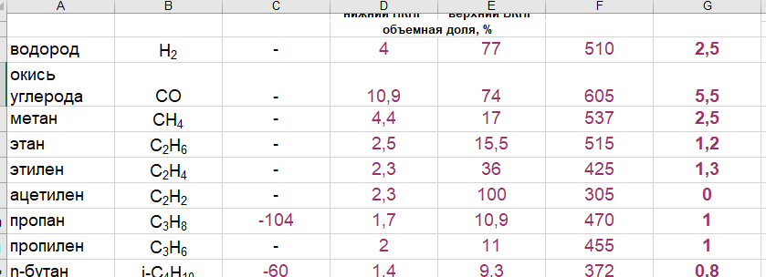

### Заполнение характеристики воспламеняемости компонентов
---

Задача: сопоставить характеристики компонентов 1С с записями из новой бд PostgreSQL

Для удобства данные из 1С конвертируются в Excel лист.


```
Использовал:
  WindowsForms
  Microsoft.Office.Interop.Excel
  Odbc
```


В процессе переноса данных возникла необходимость ручного урегулирования конфликтных ситуаций - добавил пользовательское окно
